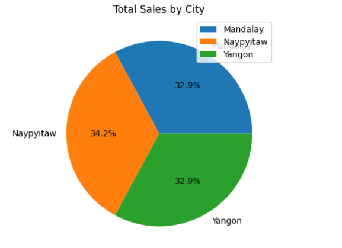
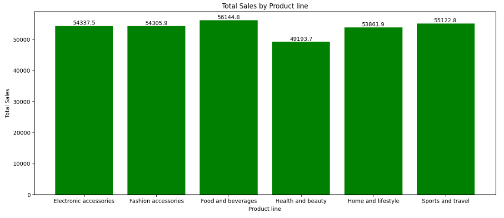
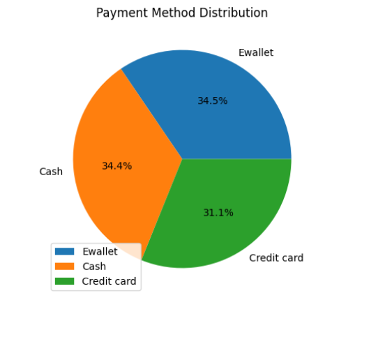
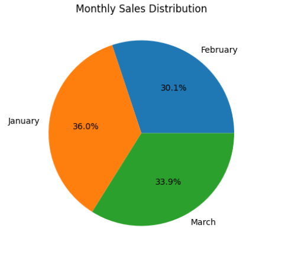
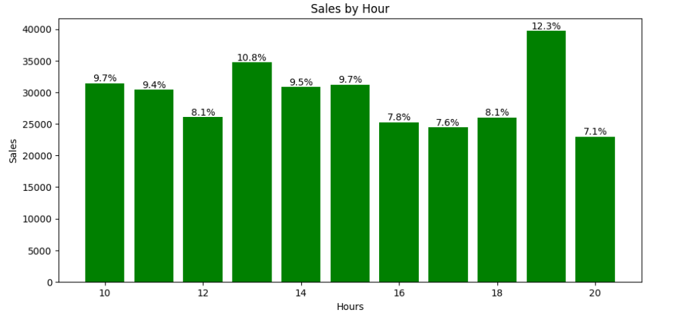
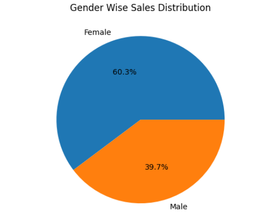

#  Supermarket Sales Analysis using Python

##  Project Overview
This project analyzes supermarket sales data to uncover key business insights related to sales performance, customer behavior, and product trends. The analysis is performed using Python libraries such as Pandas, NumPy, and Matplotlib.

---

##  Tools & Technologies
- Python
- Pandas
- NumPy
- Matplotlib

---

##  Dataset
- Supermarket Sales Dataset (Kaggle)
- Contains 1000 transaction records including product details, customer type, payment methods, and sales information.

---

##  Key Analysis Performed

### 📊 Sales Analysis
- Sales distribution by city
- Sales by product line

### 👥 Customer Analysis
- Customer type (Member vs Normal)
- Gender-based purchasing behavior

### 💳 Payment Analysis
- Most preferred payment methods

### ⏰ Time-Based Analysis
- Sales by hour
- Monthly sales trends
- 
### 💰 Profit Analysis
- Profit generated by city and product category

### ⭐ Rating Analysis
- Average customer rating by product line

---

## 📊 Visualizations

---

## 📈 Key Insights
**Top City**: Naypyitaw leads in both Revenue & Profit (34.2%)  
**Demographics**: Females are the primary shoppers, contributing 60.3% of transactions 
**Payment**: E-wallet is the most preferred payment method (34.5%) 
**Top Category**: Food & Beverages (Highest Sales & 7.11 Rating) 
**Peak Month**: January recorded peak sales of 36.0% 
**Peak Hour**: 7 PM is the busiest time for sales (12.3%) 
**Conclusion**: Strategy should focus on female-centric marketing and evening promotions in Naypyitaw,while prioritizing digital payment rewards for maximum growth.
